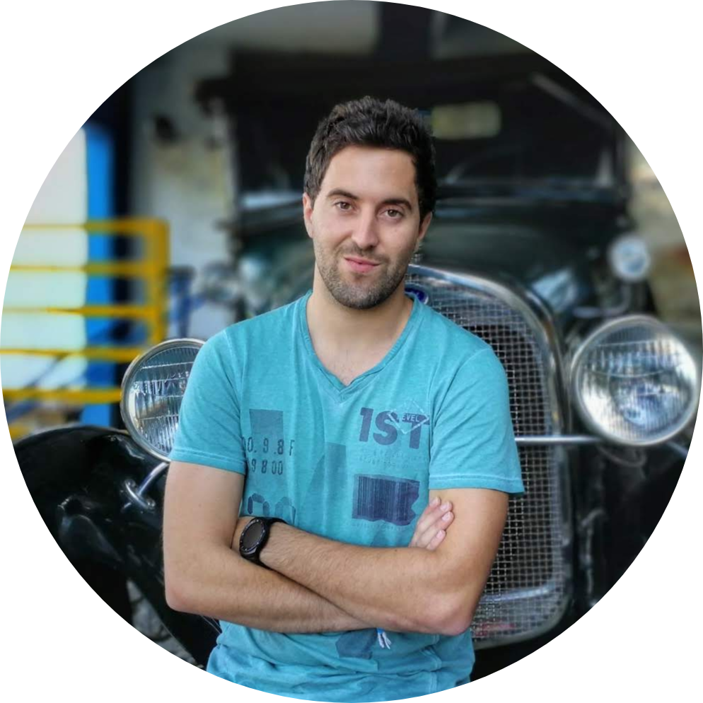

<h1 align="center">Hello friend, I'm Pedro Assunção </h1>
<!-- maybe dont need that image
   -->
<h3 align="center">DevOps Engineer with focus on Cybersecurity </h3>

  

 <!-- [Click here to count your visit](https://grabify.link/7PDB4U) -->
 

-------------------     ----------------------------
- 🏡 Living in Porto, Portugal 🇵🇹
- 🌱 Working from Home 
- 👨‍💻 I’m DevOps Engineer and Cybersecurity enthusiast at Celfocus
- 🔰 Currently working on Vodafone Qatar Project
- ⚡ Fun fact: I love Sports and Hacking ( obviously a fan of  )

## Spotify Playing 🎧

 

 
Contact with me 👻
  <!--   
  
  -->
 
  

      
  
  
  
  

### 🚀 **Working experience**
---------
Sept 2021 - Present

**Project:** Vodafone Qatar 🇶🇦 

**Main responsibilities:**

- Red hat Openshift management.
- Kubernetes management.
- Resolve incidents in the production environment.
- Setup Docker containers for test and features purposes.
- Security Champion ( Bridge between Security department and Development team, enforcing the security posture acting as an extended member of the security team)

___

 

 
 Details about my graduation   

## 📚 Education
---------

2017-2021
:   **Graduation, Computer Science and Engineering**; Universidade Lusófona do Porto

  ##  Contact programming langagues:

|                                                                                                                                                                    | **Contact Languages** |           **Course**           |
|--------------------------------------------------------------------------------------------------------------------------------------------------------------------|:-----------------:|:---------------------------:|
|            |         C         |  Fundamentos de programacao |
|              |       Python      |   Inteligência Artificial   |
|                |        HTML       | Linguagens de programação 2 |
|               |        php        | Linguagens de programação 2 |
|           |       MySQL       |        Base de Dados        |
|  |        Java       | Linguagens de programação 1 |
|                     |       Flask       |    Projeto 1                |
|                                |       Docker      |    Projeto 1                |
|                                      | React, Typescript |    Projeto 2                |

  ##  Contact IDE's
 
|  |   |  |  | 
|---|---|---|---|

 ##  **My paper for cybersecurity conference**

* Http://privacyandsecurityconference.pt/proceedings/2019/DPSC2019-paper14.pdf

___

 Academic Projects   

## 👨‍💻 Academic Projects

-  [Eshelf](https://github.com/Pedroassuncao/eShelf) 

 Used Tecnologies:

 

- [Chargefy](https://github.com/Pedroassuncao/Chargefy)

Used Tecnologies:

 
 

----------------------------------------

🤝 Languages
----------------------------------------

* Human Languages:

     * 🇵🇹 Portuguese (native speaker)
     * 🇬🇧 English
     

<!-- 

  
  -->
  

